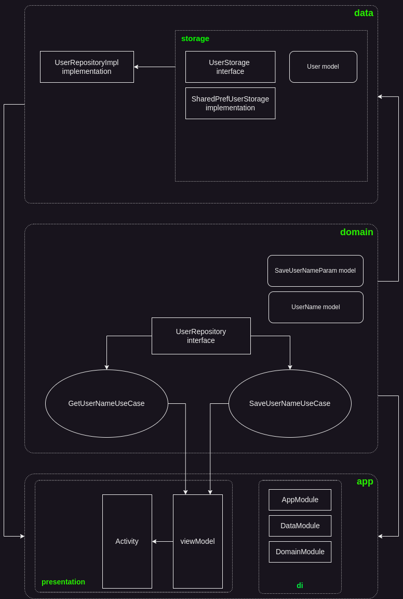

Пример использования чистой архитектуры и паттерна MVVM в простом приложении.

Branches:
- hilt-example -> использование библиотеки Hilt для встраивания зависимостей
- dagger-example -> использование библиотеки Dagger для встраивания зависимостей
- koin-example -> использование библиотеки Koin для встраивания зависимостей
- mvi-example -> импользование паттерна MVI
- mvp-example -> использование паттерна MVP

